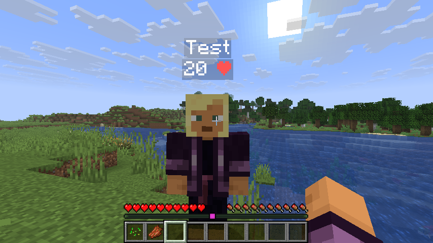

# Heart display plugin
## A plugin that display the health of the player

## How it works ?
It uses the minecraft scoreboard system

## How to use it ?
Simply, fetch the latest release and put the jar in the plugins folders